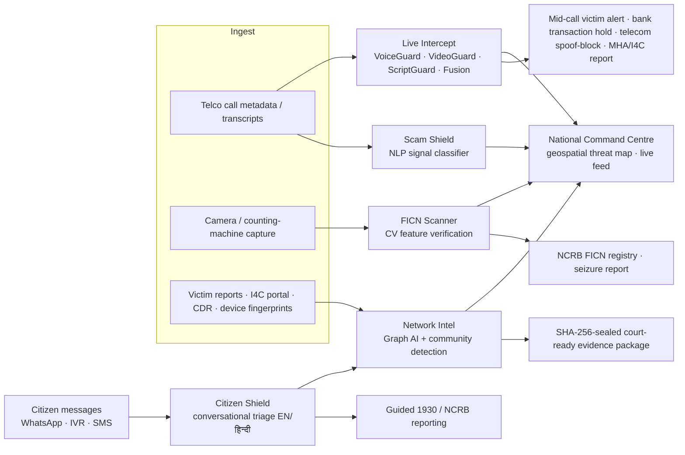

<div align="center">

# 🛡️ PRAHARI
### AI-Powered Digital Public Safety Command Centre

**ET AI Hackathon 2.0 — Phase 2 Build Sprint**
Problem Statement #6: *AI for Digital Public Safety — Defeating Counterfeiting, Fraud & Digital Arrest Scams*

*Predict. Protect. Prosecute.*

</div>

---

## The Problem

- **₹1,776 crore** defrauded from Indian citizens by "digital arrest" scams in just the first nine months of 2024 (MHA), against a backdrop of **1.14 million cybercrime complaints in 2023 (+60% YoY)** — victims held on video calls for hours by scammers impersonating CBI/police/ED officers using spoofed numbers, AI voices and deepfakes, operated from cross-border fraud compounds.
- **Lakhs of Fake Indian Currency Notes (FICN)**, dominated by high-denomination ₹500 notes, routinely bypass manual detection at local cash counters.
- Investigations today are **reactive and siloed**: individual FIRs are filed after the money is gone, while the coordinated campaign behind them stays invisible across jurisdictions.

## The Solution

PRAHARI is a unified intelligence platform for law-enforcement agencies, banks and citizens that shifts the response from **reactive case investigation to predictive threat neutralisation**, through three AI engines behind one command centre:

| Module | What it does | AI approach |
|---|---|---|
| 📡 **Live Intercept** | Replays a scam call against the full pipeline in real time: streaming transcript, synthetic-voice probability, deepfake analysis and agent fusion converge to trigger intervention **mid-call, inside the pre-transfer window** | Multi-agent fusion — NumberTrace (spoof signatures), VoiceGuard (TTS artefact detection), VideoGuard (face-swap analysis), ScriptGuard (playbook matching), Fusion (weighted escalation) |
| 🛡️ **Scam Shield** | Classifies call transcripts against digital-arrest scam playbooks with explainable phrase-level verdicts, automated telecom + MHA/I4C alerting | Hybrid NLP signal classifier — 5 weighted behavioural categories (authority impersonation, victim isolation, urgency/fear, financial extraction, identity harvesting); LLM-augmentable |
| 🔍 **FICN Scanner** | Authenticates currency notes on any smartphone/counting machine/PoS — verifies 7 RBI security features and cross-checks serials against the national seizure registry | Computer vision feature verification (security thread, watermark, microlettering, intaglio, latent image, serial pattern) |
| 🕸️ **Network Intel** | Fuses victim reports, VoIP signatures, device fingerprints and mule-account linkages into one graph; community detection surfaces the coordinated campaign across states and exports a **SHA-256-sealed, court-ready evidence package** | Graph AI — entity resolution + Louvain community detection + temporal correlation |
| 💬 **Citizen Shield** | WhatsApp-style conversational fraud triage: citizens forward suspicious calls/SMS, get an explainable verdict in **English or हिन्दी** (12-language roadmap) plus guided 1930/NCRB reporting | Same fusion engine behind a conversational layer; every triage feeds the national graph |

Plus a **National Command Centre** with a live geospatial threat map (fraud hotspots, FICN corridors, scam-origin zones) and a real-time intelligence feed fusing all five modules.

## Quick Start

```bash
npm install
npm run dev        # → http://localhost:5173
```

Demo flow (3–4 minutes):
1. **Command Centre** — national threat map + live fused intelligence feed
2. **Live Intercept** — *Begin Simulation* → watch voice/video/script agents converge on a live scam call until the full-screen intervention fires **before the transfer**
3. **FICN Scanner** — load "Suspect ₹500" → *Run Authentication* → counterfeit detected, 7-feature report
4. **Network Intel** — *Run Campaign Detection* → campaign OPX-2231 confirmed → export sealed evidence package
5. **Citizen Shield** — tap the "CBI officer" scenario → HIGH RISK verdict → toggle हिं for Hindi → file 1930 report

## Architecture



**Stack:** React 18 + Vite · Leaflet (geospatial) · force-graph (network analysis) · custom NLP scoring engine. The prototype runs fully client-side with synthetic intelligence data modelled on published I4C/NCRB patterns; production design plugs the same engines into telco SIP streams, bank hardware and the I4C complaint pipeline.

## Evaluation-Criteria Mapping

- **Scam detection precision/recall** — weighted multi-category fusion keeps single-keyword false positives low (see the benign bank-call sample scoring "low risk")
- **Counterfeit detection across denominations** — feature-verification design generalises across the RBI security-feature set
- **Lead time before mass victimisation** — campaign OPX-2231 correlated at T+31h after the first report
- **Auditability / legal admissibility** — evidence packages are SHA-256 integrity-sealed with chain-of-custody metadata

## Disclaimer

Prototype built for ET AI Hackathon 2.0. All case data, statistics shown in-app, entities and currency renders are **synthetic demonstration data**; the specimen note is a stylised SVG, not an image of real currency.

## Team

Built with ❤️ for a scam-free India.
