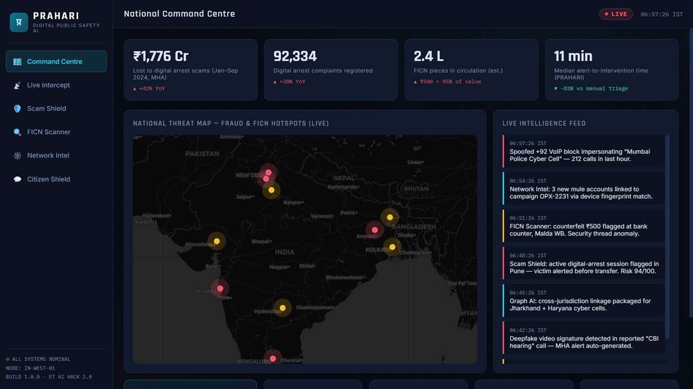
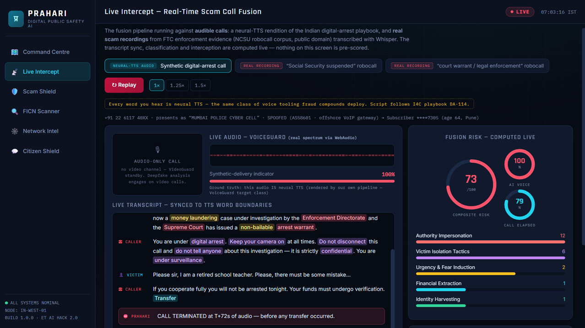
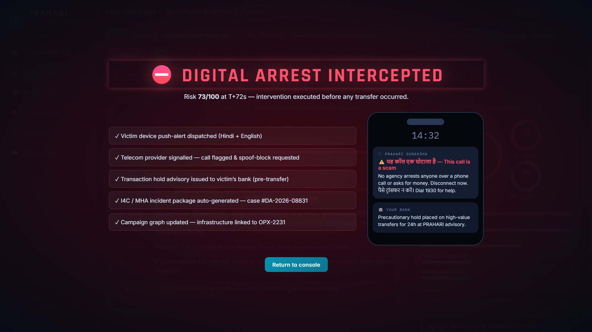
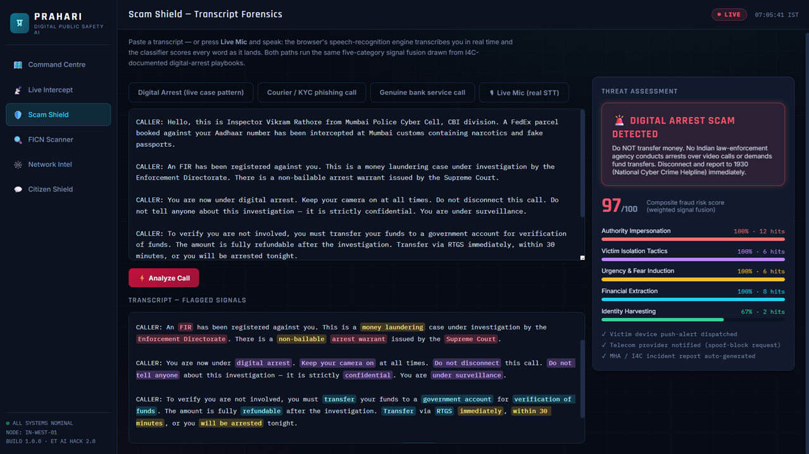
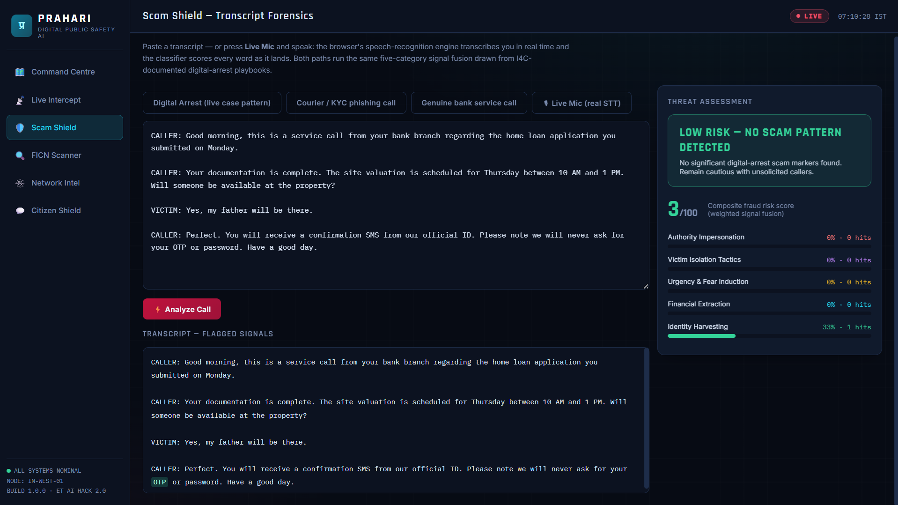
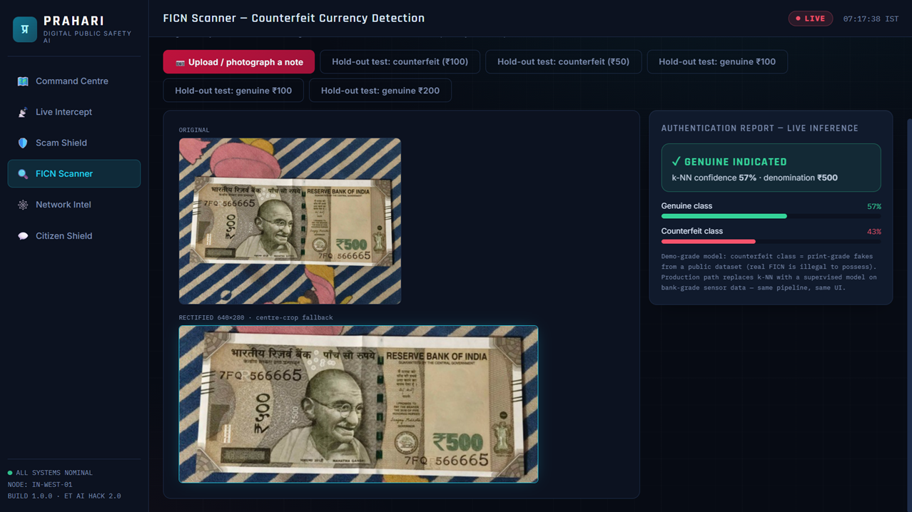
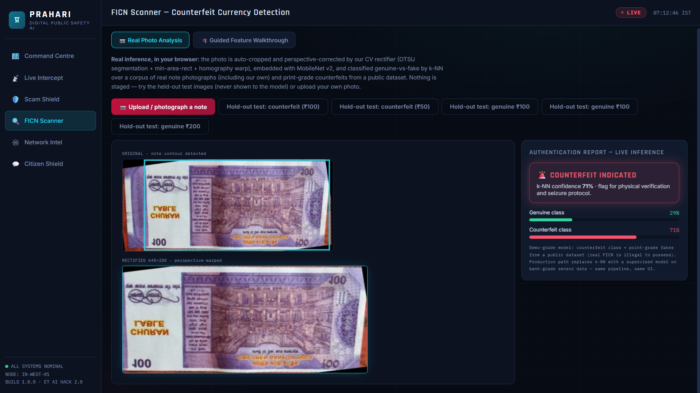
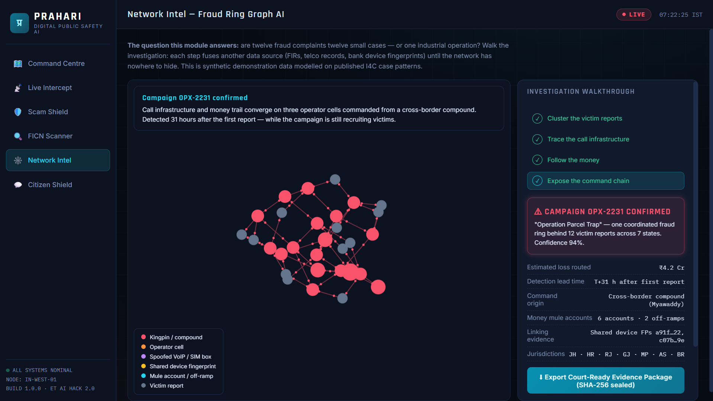
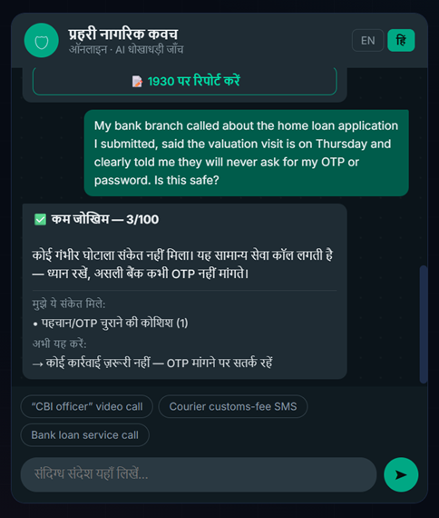
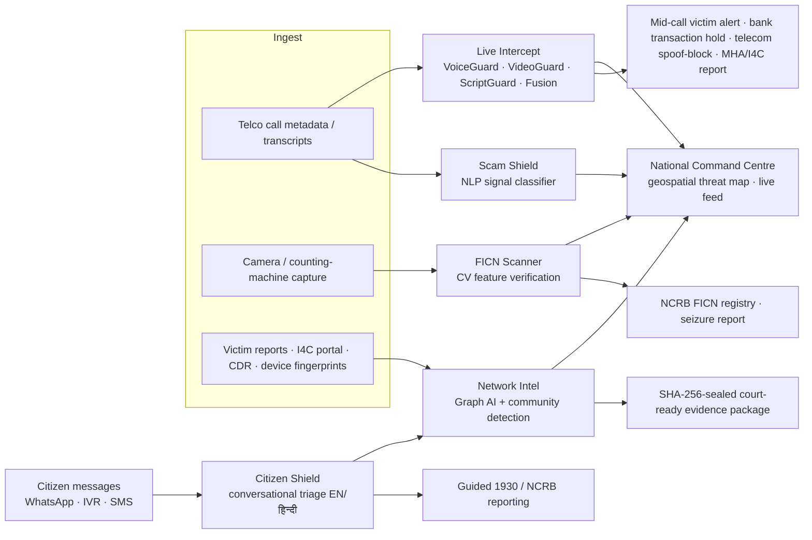

<div align="center">

# 🛡️ PRAHARI
### AI-Powered Digital Public Safety Command Centre

**ET AI Hackathon 2.0 — Phase 2 Build Sprint**
Problem Statement #6: *AI for Digital Public Safety — Defeating Counterfeiting, Fraud & Digital Arrest Scams*

*Predict. Protect. Prosecute.*

**🔴 Live demo: https://sanskar9999.github.io/prahari/** — runs entirely in your browser, phone included.



</div>

---

## The Problem

- **₹1,776 crore** defrauded from Indian citizens by "digital arrest" scams in just the first nine months of 2024 (MHA), against a backdrop of **1.14 million cybercrime complaints in 2023 (+60% YoY)** — victims held on video calls for hours by scammers impersonating CBI/police/ED officers using spoofed numbers, AI voices and deepfakes, operated from cross-border fraud compounds.
- **Lakhs of Fake Indian Currency Notes (FICN)**, dominated by high-denomination ₹500 notes, routinely bypass manual detection at local cash counters.
- Investigations today are **reactive and siloed**: individual FIRs are filed after the money is gone, while the coordinated campaign behind them stays invisible across jurisdictions.

## The Solution

PRAHARI is a unified intelligence platform for law-enforcement agencies, banks and citizens that shifts the response from **reactive case investigation to predictive threat neutralisation**, through three AI engines behind one command centre:

| Module | What it does | AI approach |
|---|---|---|
| 📡 **Live Intercept** | Plays **audible scam calls** — a neural-TTS rendition of the Indian digital-arrest playbook AND **real FTC-evidence scam recordings** — through the live pipeline: word-synced streaming transcript, real WebAudio spectrum, agent fusion, and an intervention that **pauses the actual audio mid-sentence** before the money ask completes | Neural TTS (edge-tts, word boundaries) · Whisper word-level transcription of real recordings · live NLP classification per revealed word · WebAudio AnalyserNode spectrum |
| 🛡️ **Scam Shield** | Classifies transcripts — or **your live voice via the microphone (real speech-to-text)** — against digital-arrest playbooks with explainable phrase-level verdicts | Web Speech API STT + 5-category weighted NLP signal fusion (authority impersonation, victim isolation, urgency/fear, financial extraction, identity harvesting) |
| 🔍 **FICN Scanner** | **Genuine in-browser inference on real photographs**: auto-crops and perspective-corrects the note with OpenCV, embeds with MobileNet v2, classifies genuine-vs-fake by k-NN trained on a public real/fake corpus plus our own note photos; guided RBI-feature walkthrough as a second tab | OpenCV.js contour + perspective rectification · MobileNet v2 embeddings · k-NN (Teachable-Machine approach), all client-side |
| 🕸️ **Network Intel** | Fuses victim reports, VoIP signatures, device fingerprints and mule-account linkages into one graph; community detection surfaces the coordinated campaign across states and exports a **SHA-256-sealed, court-ready evidence package** | Graph AI — entity resolution + Louvain community detection + temporal correlation |
| 💬 **Citizen Shield** | WhatsApp-style conversational fraud triage: citizens forward suspicious calls/SMS, get an explainable verdict in **English or हिन्दी** (12-language roadmap) plus guided 1930/NCRB reporting | Same fusion engine behind a conversational layer; every triage feeds the national graph |

Plus a **National Command Centre** with a live geospatial threat map (fraud hotspots, FICN corridors, scam-origin zones) and a real-time intelligence feed fusing all five modules.

## What is REAL in this prototype

We built v2 specifically so the flagship demos run on real inputs with real inference — and we label what isn't.

| Component | Status |
|---|---|
| Scam classifier (5-category weighted signal fusion) | ✅ **Real** — every verdict in every module is computed live from the text; nothing is pre-scored |
| Live Intercept audio | ✅ **Real audio** — neural TTS (edge-tts, en-IN voices) with word-boundary sync; the intervention audibly pauses the call mid-sentence |
| Real Case Replay | ✅ **Real criminal recordings** — scam robocalls from FTC enforcement evidence ([NCSU robocall-audio-dataset](https://github.com/wspr-ncsu/robocall-audio-dataset), public domain), transcribed with Whisper word timestamps, classified live with no hand-tuned trigger |
| Live Mic | ✅ **Real speech-to-text** — Web Speech API transcribes the speaker and the classifier scores every word as it lands |
| FICN Real Photo Analysis | ✅ **Real inference** — pure-JS CV rectification (OTSU segmentation → min-area rect → homography warp) + MobileNet v2 + k-NN in the browser, trained on the [Kaggle real-vs-fake notes corpus](https://www.kaggle.com/datasets/preetrank/indian-currency-real-vs-fake-notes-dataset) + our own photographs. **Hold-out accuracy: 5/5 genuine-vs-counterfeit** (images never seen by the model), denomination bonus head 2/3 |
| Voice spectrum in Live Intercept | ✅ **Real** — WebAudio AnalyserNode on the playing audio |
| Agent feed on real recordings | ✅ **Derived live** from classifier output (scripted flavour events on the TTS call only) |
| Deepfake video panel | ⚠️ Standby — no public digital-arrest video exists; validation roadmap: FakeAVCeleb / DFDC / LAV-DF corpora |
| Network Intel graph, threat-map hotspots, in-app stats | ⚠️ Synthetic demonstration data (no public per-case police data), modelled on published I4C/NCRB/MHA aggregates |
| Voice-spoof detector (VoiceGuard % score) | ⚠️ Documented ground truth per call (the TTS call *is* TTS; the robocalls are self-identified IVR) — production path: train on ASVspoof / Fake-or-Real / WaveFake |

## Try it (no install)

The app is fully static — every model runs in your browser. Deployed via GitHub Actions to GitHub Pages
(workflow in `.github/workflows/deploy.yml`): push this repo to GitHub, enable **Settings → Pages →
Source: GitHub Actions**, and the live URL appears on the workflow run. Works on phones — point your
camera at a note in the FICN scanner.

## Quick Start (local)

```bash
npm install
npm run dev        # → http://localhost:5174   (v1 fallback build runs on :5173)
```

If the audio/ML assets are missing (fresh clone), regenerate them:

```bash
pip install edge-tts faster-whisper opencv-python
python tools/generate_call_audio.py     # neural-TTS call + word timings
python tools/transcribe_recording.py    # Whisper word timestamps for the real robocalls
python tools/prepare_notes.py           # rectify + normalise the FICN training corpus
node tools/embed_notes.mjs              # precompute MobileNet embeddings (instant in-browser startup)
```

Demo flow (3–4 minutes, sound on):
1. **Command Centre** — national threat map + live fused intelligence feed
2. **Live Intercept** — select **REAL RECORDING** → *Begin* → hear an actual scam robocall get transcribed, scored and **cut off mid-sentence**; replay the TTS digital-arrest call for the full India-playbook drama
3. **Scam Shield** — press **🎙 Live Mic** and speak a scam line; watch real STT + live classification
4. **FICN Scanner** — *Real Photo Analysis* → run a hold-out test image (never seen by the model) or photograph a real note
5. **Network Intel** — *Run Campaign Detection* → campaign confirmed → export sealed evidence package
6. **Citizen Shield** — "CBI officer" scenario → HIGH RISK 74/100 → toggle हिं → file 1930 report

## Gallery

| | |
|---|---|
|  *Live Intercept — real scam audio, word-synced transcript, live fusion risk* |  *The moment PRAHARI cuts the call — before any transfer* |
|  *Scam Shield — explainable phrase-level verdict (97/100)* |  *A genuine bank call scores 3/100 — the false-positive control* |
|  *Real photo → auto-crop → MobileNet+k-NN → genuine, ₹200* |  *Held-out counterfeit caught by the in-browser model* |
|  *Guided investigation — twelve FIRs become one campaign* |  *Citizen Shield triaging in हिन्दी* |

## Architecture



**Stack:** React 18 + Vite · Leaflet (geospatial) · force-graph (network analysis) · custom NLP scoring engine. The prototype runs fully client-side with synthetic intelligence data modelled on published I4C/NCRB patterns; production design plugs the same engines into telco SIP streams, bank hardware and the I4C complaint pipeline.

## Evaluation-Criteria Mapping

- **Scam detection precision/recall** — weighted multi-category fusion keeps single-keyword false positives low (see the benign bank-call sample scoring "low risk")
- **Counterfeit detection across denominations** — feature-verification design generalises across the RBI security-feature set
- **Lead time before mass victimisation** — campaign OPX-2231 correlated at T+31h after the first report
- **Auditability / legal admissibility** — evidence packages are SHA-256 integrity-sealed with chain-of-custody metadata

## Disclaimer

Prototype built for ET AI Hackathon 2.0. All case data, statistics shown in-app, entities and currency renders are **synthetic demonstration data**; the specimen note is a stylised SVG, not an image of real currency.

## Team

Built with ❤️ for a scam-free India.
